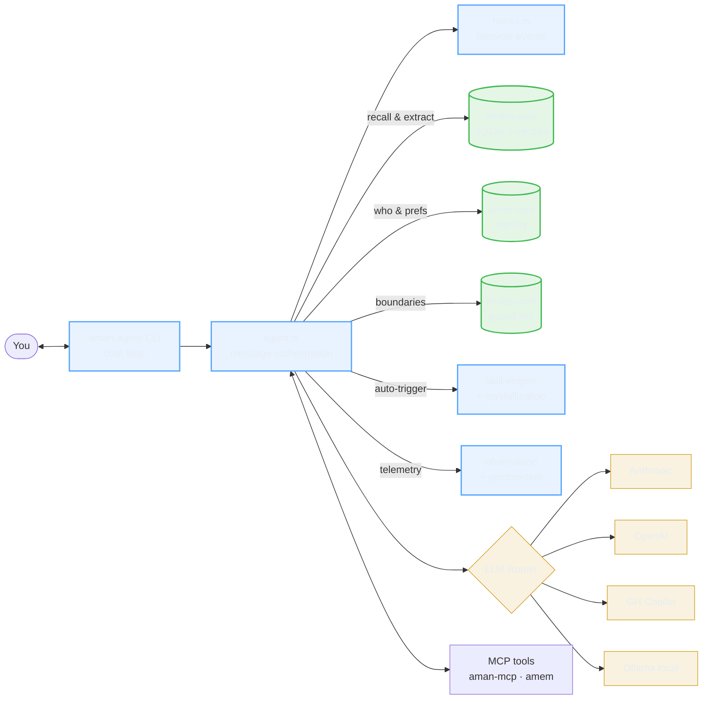
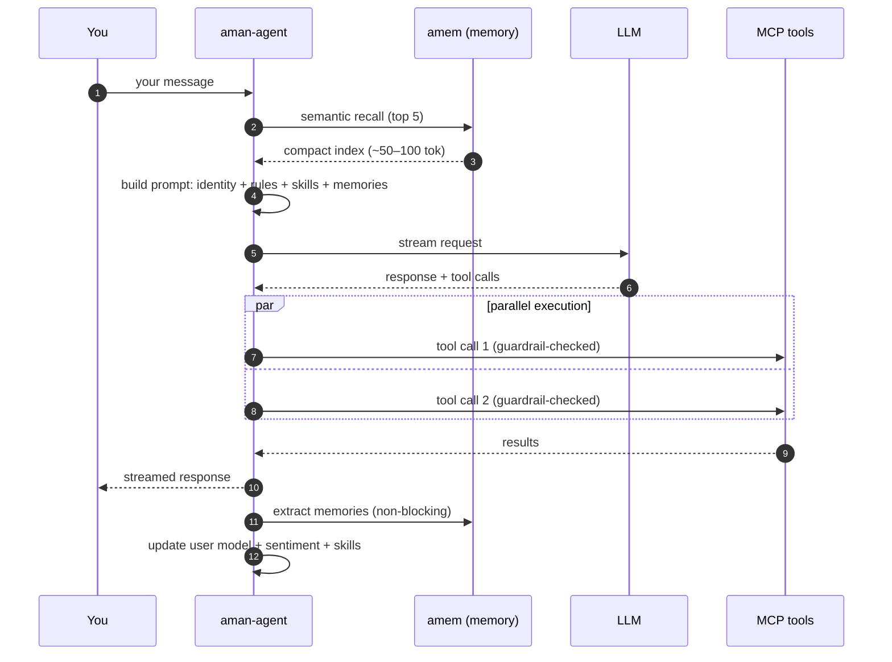

<p align="center">
  <picture>
    <source media="(prefers-color-scheme: dark)" srcset="https://img.shields.io/badge/aman--agent-runtime_layer-white?style=for-the-badge&labelColor=0d1117&color=58a6ff">
    
  </picture>
</p>

<h1 align="center">aman-agent</h1>

<p align="center">
  <strong>The AI companion that actually remembers you.</strong><br/>
  <sub>Learns from every conversation. Recalls what matters. Runs locally. Works with any LLM.</sub>
</p>

<p align="center">
  <a href="https://www.npmjs.com/package/@aman_asmuei/aman-agent"></a>
  &nbsp;
  <a href="https://github.com/amanasmuei/aman-agent/actions"></a>
  &nbsp;
  
  &nbsp;
  <a href="LICENSE"></a>
</p>

<p align="center">
  
  &nbsp;
  
  &nbsp;
  
  &nbsp;
  
  &nbsp;
  <a href="https://github.com/amanasmuei/aman"></a>
</p>

<p align="center">
  
</p>

<p align="center">
  <a href="#whats-new-in-v0330"><kbd> What's New </kbd></a>
  <a href="#quick-start"><kbd> Quick Start </kbd></a>
  <a href="#project-dev-mode-recommended"><kbd> Dev Mode </kbd></a>
  <a href="#architecture-at-a-glance"><kbd> Architecture </kbd></a>
  <a href="#features"><kbd> Features </kbd></a>
  <a href="#commands"><kbd> Commands </kbd></a>
  <a href="#supported-llms"><kbd> LLMs </kbd></a>
  <a href="#the-ecosystem"><kbd> Ecosystem </kbd></a>
  <a href="#faq"><kbd> FAQ </kbd></a>
</p>

<p align="center">
  <sub>
    <b>Install in 10 seconds →</b>&nbsp;&nbsp;<code>curl -fsSL https://raw.githubusercontent.com/amanasmuei/aman-agent/main/install.sh | bash</code>
  </sub>
</p>

---

<details>
<summary><strong>Table of Contents</strong></summary>

- [What's New](#whats-new-in-v0330)
- [The Problem](#the-problem)
- [The Solution](#the-solution)
- [Architecture at a Glance](#architecture-at-a-glance)
- [Quick Start](#quick-start)
- [Usage Guide](#usage-guide)
  - [Project Dev Mode](#project-dev-mode-recommended)
  - [Your First Conversation](#your-first-conversation)
  - [How Memory Works](#how-memory-works)
  - [Files & Images](#working-with-files--images)
  - [Plans](#working-with-plans)
  - [Skills](#skills-in-action)
  - [Project Workflow](#project-workflow)
  - [Personality & Wellbeing](#personality--wellbeing)
  - [Customization](#customization)
  - [Showcase Templates](#showcase-templates)
  - [Profiles](#your-profile-vs-agent-profiles)
  - [Delegation](#agent-delegation)
  - [Teams](#agent-teams)
  - [Multi-agent (A2A)](#multi-agent-a2a)
  - [Daily Workflow](#daily-workflow-summary)
- [Features](#features)
- [How It Works](#how-it-works)
- [Commands](#commands)
- [What It Loads](#what-it-loads)
- [Supported LLMs](#supported-llms)
- [Configuration](#configuration)
- [The Ecosystem](#the-ecosystem)
- [What Makes This Different](#what-makes-this-different)
- [FAQ](#faq)
- [Contributing](#contributing)

</details>

---

## What's New in v0.33.0

> **One command. Full context. Zero setup.**

### `aman-agent dev` — Your New Way to Start Coding

```bash
cd ~/projects/amantrade && aman-agent dev
```

Open any project, and aman-agent **automatically detects your stack**, **recalls your past decisions from memory**, and **generates a project-specific CLAUDE.md** — then launches Claude Code with everything loaded. No more re-explaining yourself.

```
$ aman-agent dev ~/projects/amantrade

  Detected: Go (Fiber) + Postgresql + Docker + Github-actions
  Recalled: 8 memories (4 decisions, 3 corrections, 1 convention)
  ✓ CLAUDE.md written (template mode)

  Launching Claude Code...
```

| Flag | What it does |
|:---|:---|
| `--smart` | Use your configured LLM to synthesize a smarter CLAUDE.md |
| `--yolo` | Launch Claude Code with `--dangerously-skip-permissions` (full autonomous mode) |
| `--no-launch` | Generate CLAUDE.md only, don't start Claude Code |
| `--diff` | Preview what would change without writing |
| `--force` | Regenerate even if CLAUDE.md is fresh |

Works with **multiple projects** simultaneously — each terminal gets its own `aman-agent dev`, all sharing the same memory database. Decisions from one project flow into the next.

---

<details>
<summary><strong>v0.32.0 — Install anywhere, zero prerequisites</strong></summary>

### Install on any machine — no Node.js required

```bash
curl -fsSL https://raw.githubusercontent.com/amanasmuei/aman-agent/main/install.sh | bash
```

Works on **Linux** (x64, arm64, armv7l), **macOS** (x64, Apple Silicon), **Raspberry Pi**, **VPS**, and **servers**. Vendors Node.js 22 LTS invisibly. No sudo needed.

| Feature | Details |
|:---|:---|
| **Consolidated config** | All state now lives under `~/.aman-agent/` — one directory to backup, sync, or `scp` to a new machine. Existing users are auto-migrated on first run. |
| **Docker support** | `docker run -it -e ANTHROPIC_API_KEY=sk-... ghcr.io/amanasmuei/aman-agent` — multi-arch image (amd64 + arm64). |
| **`aman-agent setup`** | Full configuration wizard — provider, identity, and presets. |
| **`aman-agent update`** | Self-update, works with both vendored and npm installs. |
| **`aman-agent uninstall`** | Clean removal of all data and config. |
| **Headless mode** | Auto-detects LLM provider from env vars. Clean error when no TTY (systemd, Docker, CI). |

</details>

<details>
<summary><strong>Highlights from earlier releases</strong></summary>

**v0.31 — Multi-agent (A2A) via MCP server mode**
- `aman-agent serve` runs any profile as a local MCP server
- `/delegate @coder <task>` for cross-agent delegation
- `/agents list|info|ping` for discovery and health checks

**v0.30 — Agent hardening**
- Delegation confirmation prompts (no more silent sub-agents)
- Persistent background task state surviving crashes
- Rich `/eval report` with trust, sentiment, energy, burnout risk

**v0.29 — Ecosystem parity**
- Auto-relate memories after extraction (knowledge graph edges)
- Stale reference cleanup

**v0.28 — Learning loop completion**
- Rejection feedback, cross-session reinforcement, skill merging + versioning
- Adaptive nudge learning, semantic trigger matching, feed-forward v2
- LLM-based sentiment, burnout predictor, `/skills list --auto` enhancements

**v0.27 — Dynamic user model**
- Cross-session profile: trust (EMA), sentiment baseline, energy distribution
- Feed-forward personalized energy/mode overrides
- Frustration correlations (Pearson r), nudge tracking
- `/identity dynamics` view + `--json` + `--reset`

**v0.26 — Skill crystallization**
- Post-mortems identify reusable procedures → opt-in prompt → saved as auto-triggering skills
- Runtime trigger matching, `/skills crystallize`, `/skills list --auto`
- Post-mortem JSON sidecar for lossless re-parsing

**v0.24 — Observation & post-mortem**
- Passive session telemetry (tool calls, errors, file changes, sentiment, blockers)
- LLM-generated post-mortem reports with smart auto-trigger
- Pattern memory loop — the agent learns from its own session history
- `/observe` dashboard, `/postmortem` commands

**v0.18 — User onboarding**
- Interactive first-run setup capturing name, role, expertise, communication style
- 13 showcase templates (fitness, freelancer, Muslim, finance, etc.)
- `/profile me` and `/profile edit` for user identity management

**v0.16 — Session resilience**
- Streaming cancellation (Ctrl+C aborts response, not session)
- Session checkpointing every 10 turns — crash-safe
- MCP auto-reconnect on connection failure
- Token-safe tool loop with conversation trimming inside
- Non-blocking memory extraction

**v0.14 — Sub-agent infrastructure**
- Sub-agent guardrails enforce same safety rules as main agent
- Sub-agent memory recall for better delegation context
- 16K system prompt token ceiling

</details>

<a href="https://github.com/amanasmuei/aman-agent/releases">Full release history →</a>

---

## The Problem

AI coding assistants forget everything between sessions. You re-explain your stack, preferences, and boundaries every time. There's no single place where your AI loads its full context and just *works*.

Other "memory" solutions are just markdown files the AI reads on startup — they don't *learn* from conversation, they don't *recall* per-message, and they silently lose context when the window fills up.

## The Solution

**aman-agent** is the first open-source AI companion that genuinely learns from conversation. It doesn't just store memories — it recalls them per-message, extracts new knowledge automatically, and uses your LLM to intelligently compress context instead of truncating it.

```bash
npx @aman_asmuei/aman-agent
```

> **Your AI knows who it is, what it remembers, what tools it has, what rules to follow, what time it is, and what reminders are due — before you say a word.**

---

## Architecture at a Glance

aman-agent is the **runtime** at the center of the aman ecosystem — 38 focused TypeScript modules that stitch together 7 portable memory/identity/skill layers with any LLM you want.



<details>
<summary><strong>How the pieces work together</strong></summary>

| Piece | What it does | Where it lives |
|:---|:---|:---|
| `agent.ts` | The main event loop — reads your message, recalls memories, streams the LLM response, executes tools, extracts new memories | `src/agent.ts` (40 KB) |
| `commands.ts` | 58+ slash commands (`/memory`, `/skills`, `/plan`, `/delegate`, `/eval`, `/observe`, `/postmortem`, …) | `src/commands.ts` (98 KB) |
| `hooks.ts` | 5 lifecycle hooks that fire at startup, before/after tools, on workflow match, on session end | `src/hooks.ts` (26 KB) |
| `memory.ts` + `memory-extractor.ts` | Per-message recall and silent, non-blocking extraction of preferences, decisions, patterns, corrections | delegates to `@aman_asmuei/amem-core@0.5` |
| `skill-engine.ts` + `crystallization.ts` | Auto-triggers domain skills from context; promotes post-mortem lessons into reusable, versioned skills | `src/skill-engine.ts`, `src/crystallization.ts` |
| `user-model.ts` + `personality.ts` | Cross-session trust (EMA), sentiment baseline, burnout risk, time-of-day tone shifts, wellbeing nudges | `src/user-model.ts`, `src/personality.ts` |
| `observation.ts` + `postmortem.ts` | Passive session telemetry + LLM-generated structured post-mortems on session end | `src/observation.ts`, `src/postmortem.ts` |
| `dev/` | Project stack detection, context assembly, CLAUDE.md generation — powers `aman-agent dev` | `src/dev/` |
| `llm/` | 6 pluggable providers — Anthropic, OpenAI, Ollama, GitHub Copilot, OpenAI-compatible, Claude Code CLI | `src/llm/` |
| `mcp/` | MCP v1.27 client with stdio transport and auto-reconnect | `src/mcp/` |

**Stateless by default.** All state lives in `~/.aman-agent/` — identity, rules, workflows, skills, eval, and memory in one portable directory. Nothing leaves your machine except what you send to your chosen LLM.

</details>

---

## Quick Start

### 1. Install

```bash
# One-liner install (no Node.js required) — Linux, macOS, Raspberry Pi
curl -fsSL https://raw.githubusercontent.com/amanasmuei/aman-agent/main/install.sh | bash

# Or via npm (if you already have Node.js 18+)
npm install -g @aman_asmuei/aman-agent

# Or via Docker
docker run -it -e ANTHROPIC_API_KEY=sk-... ghcr.io/amanasmuei/aman-agent
```

### 2. Run

```bash
# Start a conversation
aman-agent

# Or jump straight into a project with full context
aman-agent dev ~/projects/my-app
```

**Zero config if you already have an API key in your environment:**

```bash
# aman-agent auto-detects these (in priority order):
export ANTHROPIC_API_KEY="sk-ant-..."   # → uses Claude Sonnet 4.6
export OPENAI_API_KEY="sk-..."          # → uses GPT-4o
# Or if Ollama is running locally      # → uses llama3.2
```

No env var? First run prompts for your LLM provider and model:

```
◇ LLM provider
│ ● Claude (Anthropic)       — recommended, uses Claude Code CLI
│ ○ GitHub Copilot           — uses GitHub Models API
│ ○ GPT (OpenAI)
│ ○ Ollama (local)           — free, runs offline
```

**Claude** — authentication handled by Claude Code CLI (`claude login`). Supports subscription (Pro/Max/Team/Enterprise), API billing, Bedrock, and Vertex AI. No API key needed.

**GitHub Copilot** — authentication handled by GitHub CLI (`gh auth login`). Uses GitHub Models API with access to GPT-4o, Claude Sonnet, Llama, Mistral, and more.

**OpenAI** — enter your API key directly.

**Ollama** — local models, no account needed.

### 2. First Launch — You'll Be Asked About You

On first run, a quick interactive setup captures who you are:

```
◆ What should I call you?
◆ What's your main thing?     (developer, designer, student, manager, generalist)
◆ How deep in the game?       (beginner → expert)
◆ How do you like answers?    (concise, balanced, thorough, socratic)
◆ What are you working on?    (optional)
◆ Want a companion specialty? (13 pre-built personalities from aman-showcase)
```

Takes ~30 seconds. Update anytime with `/profile edit`.

### 3. Talk

```bash
# Override model per session
aman-agent --model claude-opus-4-6

# Adjust system prompt token budget
aman-agent --budget 12000
```

---

## Usage Guide

A step-by-step walkthrough of how to use aman-agent day-to-day. Click any section below to expand.

<details open>
<summary><strong>Project Dev Mode (recommended)</strong></summary>

### Project Dev Mode

The fastest way to start working on any project. One command sets up everything:

```bash
aman-agent dev
```

**What happens:**

1. **Stack Detection** — Scans your project directory for `package.json`, `go.mod`, `Cargo.toml`, `pyproject.toml`, `pubspec.yaml`, `docker-compose.yml`, `.github/workflows/`, and more
2. **Memory Recall** — Queries your amem database for past decisions, corrections, and conventions related to this project and stack
3. **Context Assembly** — Pulls your identity (acore), guardrails (arules), and developer preferences into a structured CLAUDE.md
4. **Auto-Launch** — Launches Claude Code in the project directory with full context loaded

```
$ aman-agent dev ~/projects/amantrade

  Detected: Go (Fiber) + Postgresql + Docker + Github-actions
  Recalled: 8 memories (4 decisions, 3 corrections, 1 convention)
  ✓ CLAUDE.md written (template mode)

  Launching Claude Code...
```

**Smart mode** — Use your LLM to synthesize a more tailored CLAUDE.md:

```bash
aman-agent dev --smart
```

The LLM merges related corrections into single convention statements and removes redundancy. Falls back to template mode automatically if the LLM call fails.

**Yolo mode** — Full autonomous, no permission prompts:

```bash
aman-agent dev --yolo          # skip permissions
aman-agent dev --yolo --smart  # skip permissions + LLM-generated CLAUDE.md
```

Launches Claude Code with `--dangerously-skip-permissions`. Use when you trust the project and want zero friction.

**Multi-project workflow** — Each terminal is independent:

```bash
# Terminal 1
aman-agent dev ~/projects/amantrade

# Terminal 2
aman-agent dev ~/projects/aman-mcp

# Terminal 3
aman-agent dev ~/projects/new-api
```

All three share the same amem database. A decision you make in one project is available to the others on next run.

**Staleness detection** — If you've made new decisions since the last CLAUDE.md generation, `aman-agent dev` auto-updates it and shows you what changed:

```
✓ CLAUDE.md updated (3 changes)
  + Added: zerolog convention (from correction 2026-04-10)
  + Added: rate limiting at gateway level (from decision 2026-04-11)
  - Removed: slog preference (superseded by zerolog correction)
```

If the CLAUDE.md is still fresh, it skips regeneration and launches Claude Code immediately.

</details>

<details>
<summary><strong>Your First Conversation</strong></summary>

### Your First Conversation

On first run, you set up your profile, then the agent greets you personally:

```
$ aman-agent

  aman agent — your AI companion
  ✓ Auto-detected Anthropic API key. Using claude-sonnet-4-6.
  ✓ Profile saved for Aman
  ✓ Loaded: identity, user, guardrails (2,847 tokens)
  ✓ Memory consolidated
  ✓ MCP connected
  ✓ Aman is ready for Aman. Model: claude-sonnet-4-6

You > Hey, I'm working on a Node.js API

 Aman ──────────────────────────────────────────────

  Nice to meet you! I'm Aman, your AI companion. I'll remember
  what matters across our conversations — your preferences,
  decisions, and patterns.

  What kind of API are you building? I can help with architecture,
  auth, database design, or whatever you need.

 ────────────────────────────────────── [1 memory stored]
```

That's it. No setup required. The agent remembers your stack from this point forward.

</details>

<details>
<summary><strong>How Memory Works</strong></summary>

### How Memory Works

Memory is automatic. You don't need to do anything — the agent silently extracts important information from every conversation:

- **Preferences** — "I prefer Vitest over Jest" → remembered
- **Decisions** — "Let's use PostgreSQL" → remembered
- **Patterns** — "User always writes tests first" → remembered
- **Facts** — "The auth service is in /services/auth" → remembered

Memory shows up naturally in responses:

```
You > Let's add a new endpoint

 Aman ──────────────────────────────────────────────

  Based on your previous decisions, I'll set it up with:
  - PostgreSQL (your preference)
  - JWT auth (decided last session)
  - Vitest for tests

 ──────────────────────────────── memories: ~47 tokens
```

**Useful memory commands:**

```
/memory search auth      Search your memories
/memory timeline         See memory growth over time
/decisions               View your decision log
```

</details>

<details>
<summary><strong>Working with Files & Images</strong></summary>

### Working with Files & Images

Reference any file path in your message — it gets attached automatically:

```
You > Review this code ~/projects/api/src/auth.ts

  [attached: auth.ts (3.2KB)]

 Aman ──────────────────────────────────────────────
  Looking at your auth middleware...
```

**Images** work the same way — the agent can see them:

```
You > What's wrong with this schema? ~/Desktop/schema.png

  [attached image: schema.png (142.7KB)]

 Aman ──────────────────────────────────────────────
  I see a few issues with your schema...
```

**Supported files:**
- **Code/text:** `.ts`, `.js`, `.py`, `.go`, `.rs`, `.md`, `.json`, `.yaml`, and 30+ more
- **Images:** `.png`, `.jpg`, `.jpeg`, `.gif`, `.webp`, `.bmp` (also URLs)
- **Documents:** `.pdf`, `.docx`, `.xlsx`, `.pptx` (via Docling)

Multiple files in one message work too.

</details>

<details>
<summary><strong>Working with Plans</strong></summary>

### Working with Plans

Plans help you track multi-step work that spans sessions.

**Create a plan:**

```
You > /plan create Auth API | Ship JWT auth | Design schema, Build endpoints, Write tests, Deploy

  Plan created!

  Plan: Auth API (active)
  Goal: Ship JWT auth
  Progress: [░░░░░░░░░░░░░░░░░░░░] 0/4 (0%)

     1. [ ] Design schema
     2. [ ] Build endpoints
     3. [ ] Write tests
     4. [ ] Deploy

  Next: Step 1 — Design schema
```

**Mark progress as you work:**

```
You > /plan done

  Step 1 done!

  Plan: Auth API (active)
  Progress: [█████░░░░░░░░░░░░░░░] 1/4 (25%)

     1. [✓] Design schema
     2. [ ] Build endpoints      ← Next
     3. [ ] Write tests
     4. [ ] Deploy
```

**The AI knows your plan.** Every turn, the active plan is injected into context. The AI knows which step you're on and reminds you to commit after completing steps.

**Resume across sessions.** Close the terminal, come back tomorrow — your plan is still there:

```
$ aman-agent

  Welcome back. You're on step 2 of Auth API — Build endpoints.
```

**All plan commands:**

```
/plan                Show active plan
/plan done [step#]   Mark step complete (next if no number)
/plan undo <step#>   Unmark a step
/plan list           Show all plans
/plan switch <name>  Switch active plan
/plan show <name>    View a specific plan
```

Plans are stored as markdown in `.acore/plans/` — they're git-trackable.

</details>

<details>
<summary><strong>Skills in Action</strong></summary>

### Skills in Action

Skills activate automatically based on what you're talking about. No commands needed.

```
You > How should I handle SQL injection in this query?

  [skill: security Lv.3 activated]
  [skill: database Lv.2 activated]

 Aman ──────────────────────────────────────────────
  Use parameterized queries — never interpolate user input...
```

**Skills level up as you use them:**

| Level | Label | What changes |
|:---|:---|:---|
| Lv.1 | Learning | Detailed explanations, examples |
| Lv.2 | Familiar | Brief reasoning, show patterns |
| Lv.3 | Proficient | Task-focused, skip basics |
| Lv.4 | Advanced | Edge cases, proactive suggestions |
| Lv.5 | Expert | Just execute, no hand-holding |

Skills also self-improve — when the agent learns your patterns (e.g., "user prefers Prisma over raw SQL"), it enriches the skill with your preferences.

**12 built-in skill domains:** testing, api-design, security, performance, code-review, documentation, git-workflow, debugging, refactoring, database, typescript, accessibility

**10 knowledge library items** auto-suggested when relevant: security-headers, docker-node, github-actions, env-config, error-handling, rate-limiter, prisma-setup, zod-validation, testing-patterns, git-hooks

</details>

<details>
<summary><strong>Project Workflow</strong></summary>

### Project Workflow

aman-agent is project-aware. When you run it in a project directory, it loads project-specific context.

**Set up a project:**

```bash
cd ~/my-project
npx @aman_asmuei/acore        # Creates .acore/context.md with detected stack
aman-agent                     # Loads project context automatically
```

**What gets scoped to your project:**
- Decisions and topology (stored in amem with `project:my-project` scope)
- Session state (saved to `.acore/context.md` on exit)
- Plans (stored in `.acore/plans/`)

**Switch projects naturally:**

```bash
cd ~/project-a && aman-agent   # Loads project-a context + memories
cd ~/project-b && aman-agent   # Loads project-b context + memories
```

Global preferences (coding style, tool choices) carry across all projects.

</details>

<details>
<summary><strong>Personality & Wellbeing</strong></summary>

### Personality & Wellbeing

The agent adapts its tone based on time of day and how you're doing:

- **Morning:** energetic, direct
- **Afternoon:** steady, focused
- **Evening:** warm, winding down
- **Late night:** gentle, reflective

It also reads your messages for frustration, confusion, or fatigue — and adapts:

```
You > ugh nothing works, tried everything!!

  [sentiment: frustrated]

 Aman ──────────────────────────────────────────────
  That sounds frustrating. Let's step back and try a different
  angle — what changed since it last worked?
```

**Wellbeing nudges** appear when needed:
- Long late-night session → gentle suggestion to rest
- 90+ minutes of frustration → suggest a break
- User seems tired → concise responses, support wrapping up

These are one-time nudges — the agent won't nag.

</details>

<details>
<summary><strong>Customization</strong></summary>

### Customization

**Persona presets** for different work styles:

```bash
aman-agent init
# Choose: Coding Partner, Creative Collaborator,
#          Personal Assistant, Learning Buddy, or Minimal
```

**Guardrails** control what the AI should and shouldn't do:

```
/rules add Coding Always write tests before merging
/rules add Never Delete production data without confirmation
```

**Workflows** teach the AI multi-step processes:

```
/workflows add code-review
```

**Hook toggles** in `~/.aman-agent/config.json`:

```json
{
  "hooks": {
    "memoryRecall": true,
    "personalityAdapt": true,
    "extractMemories": true,
    "featureHints": true
  }
}
```

Set any to `false` to disable.

</details>

<details>
<summary><strong>Showcase Templates</strong></summary>

### Showcase Templates

Give your companion a pre-built specialty from [aman-showcase](https://github.com/amanasmuei/aman-showcase):

| Template | What it does |
|:---|:---|
| **Muslim** | Islamic daily companion — prayer times, hadith, du'a |
| **Quran** | Quranic Arabic vocabulary with transliteration |
| **Fitness** | Personal trainer — workout tracking, nutrition |
| **Freelancer** | Client & invoice tracking for independents |
| **Kedai** | Small business assistant (BM/EN) |
| **Money** | Personal finance & budget tracker |
| **Monitor** | Price/website/keyword watchdog |
| **Bahasa** | Malay/English language tutor |
| **Team** | Standups, tasks, team memory |
| **Rutin** | Medication reminders for family |
| **Support** | Customer support with escalation |
| **IoT** | Sensor monitoring for smart homes |
| **Feed** | News aggregation & filtering |

Install during onboarding or anytime:

```bash
npx @aman_asmuei/aman-showcase install muslim
```

Each template includes identity, workflows, rules, and domain skills — all installed into your ecosystem.

</details>

<details>
<summary><strong>Your Profile vs Agent Profiles</strong></summary>

### Your Profile vs Agent Profiles

**Your profile** is who YOU are — name, role, expertise, communication style. Set during onboarding, injected into every conversation:

```
/profile me            View your profile
/profile edit          Edit a field
/profile setup         Re-run full setup
```

**Agent profiles** are different AI personalities for different tasks:

```bash
aman-agent --profile coder      # direct, code-first
aman-agent --profile writer     # creative, story-driven
aman-agent --profile researcher # analytical, citation-focused
```

Each agent profile has its own identity, rules, and skills — but shares the same memory. Create profiles:

```
/profile create coder       Install built-in template
/profile create mybot       Create custom profile
/profile list               Show all profiles
```

</details>

<details>
<summary><strong>Agent Delegation</strong></summary>

### Agent Delegation

Delegate tasks to sub-agents with specialist profiles:

```
/delegate writer Write a blog post about AI companions

  [delegating to writer...]

  [writer] ✓ (2 tool turns)
  # Building AI Companions That Actually Remember You
  ...
```

**Pipeline delegation** — chain agents sequentially:

```
/delegate pipeline writer,researcher Write and fact-check an article

  [writer] ✓ — drafted article
  [researcher] ✓ — verified claims, added citations
```

The AI also **auto-suggests delegation** when it recognizes a task matches a specialist profile — always asks for your permission first.

</details>

<details>
<summary><strong>Agent Teams</strong></summary>

### Agent Teams

Named teams of agents that collaborate on complex tasks:

```
/team create content-team        Install built-in team
/team run content-team Write a blog post about AI

  Team: content-team (pipeline)
  Members: writer → researcher

  [writer: drafting...] ✓
  [researcher: fact-checking...] ✓

  Final output with verified claims.
```

**3 execution modes:**

| Mode | How it works |
|:---|:---|
| `pipeline` | Sequential: agent1 → agent2 → agent3 |
| `parallel` | All agents work concurrently, coordinator merges |
| `coordinator` | AI plans how to split the task, assigns to members |

**Built-in teams:**

| Team | Mode | Members |
|:---|:---|:---|
| `content-team` | pipeline | writer → researcher |
| `dev-team` | pipeline | coder → researcher |
| `research-team` | pipeline | researcher → writer |

Create custom teams:

```
/team create review-squad pipeline coder:implement,researcher:review
/team run review-squad Build a rate limiter in TypeScript
```

The AI auto-suggests teams when appropriate — always asks permission first.

</details>

<details>
<summary><strong>Multi-agent (A2A)</strong> (new in v0.31)</summary>

### Multi-agent (A2A)

Run aman-agent as a local MCP server so other aman-agent instances — on the same machine — can delegate tasks to it via the `@name` syntax. No new protocol, no new daemon, no broker — just MCP over localhost using the existing `@modelcontextprotocol/sdk` bits.

**Start a specialist agent in server mode:**

```bash
aman-agent serve --name coder --profile coder
  ✓ Ecosystem loaded
  ✓ registered as @coder
  ✓ port 52341 (127.0.0.1) — token is in ~/.aman-agent/registry.json
```

Leave it running. The process binds an ephemeral localhost port and writes its `{name, pid, port, token}` into `~/.aman-agent/registry.json` (mode `0600`). On `SIGINT`/`SIGTERM` it cleans up the registry entry.

**From another aman-agent instance, delegate to it:**

```
You > /agents list

  Running agents:
    @coder         coder         pid=4512   port=52341  up 34s

You > /delegate @coder Refactor src/auth.ts to use async/await

  [delegating to @coder...]
  ✓ @coder completed in 12.4s
  ...
```

**Commands:**

| Command | What it does |
|:---|:---|
| `aman-agent serve --name X --profile Y` | Run as a local A2A server |
| `/agents list` | Show running agents on this machine |
| `/agents info <name>` | Call `agent.info` MCP tool on the named agent |
| `/agents ping <name>` | Bearer-authed `/health` latency check |
| `/delegate @<name> <task>` | Delegate via MCP to another running agent |

**How it works:** Each `serve` process binds an ephemeral localhost port, mounts an MCP `StreamableHTTPServerTransport`, and writes its `{name, profile, pid, port, token}` into `~/.aman-agent/registry.json` (mode `0600`). The calling agent looks up the target in the registry, dials via `StreamableHTTPClientTransport` with the bearer token, and invokes the `agent.delegate` MCP tool. Three tools are exposed on every `serve` instance: `agent.info`, `agent.delegate`, `agent.send`.

**Trust model:** Same-user, same-machine. OS file permissions on `~/.aman-agent/registry.json` are the trust boundary — if you can read the registry, you know the tokens. Cross-machine A2A is a future addition; it will need explicit auth and is out of scope for v0.31.

**Known limitations (v0.31):**

- **Event-loop leak on `delegateRemote`** — the MCP SDK's `StreamableHTTPClientTransport` keeps an internal resource alive after `close()` / `terminateSession()`, so a Node script that calls `delegateTask("@name", ...)` and expects clean exit must call `process.exit(0)` explicitly. The interactive REPL is unaffected (it exits via `/quit`). Follow-up investigation planned.
- **No cross-machine A2A** — registry is a local JSON file; LAN/remote agents not supported yet.
- **`agent.send` is in-memory only** — messages are lost if the target agent crashes before draining them.
- **No proactive push to humans** — delivering a message to Telegram/Discord/etc. is `achannel`'s job, not aman-agent's.

</details>

<details>
<summary><strong>Session Telemetry & Post-Mortems</strong> (new in v0.24)</summary>

### Session Telemetry & Post-Mortems

aman-agent now passively observes what happens during a session and can produce a structured post-mortem on demand or automatically.

**Live observation dashboard:**

```
You > /observe

  Session: 47 min | Tools: 23 calls (2 errors) | Files: 5 changed
  Blockers: 1 | Milestones: 3 | Topic shifts: 2
```

**Pause / resume capture** when you don't want noisy commands recorded:

```
You > /observe pause
  Observation paused. Use /observe resume to continue.
```

**Generate a post-mortem on demand:**

```
You > /postmortem

  # Post-Mortem: 2026-04-11
  **Session:** session-2026-04-11-2143 | **Duration:** 47 min | **Turns:** 23

  ## Summary
  Refactored the auth middleware and shipped JWT validation...

  ## Completed
  - [x] Extracted token handler
  - [x] Wired rate limiter

  ## Blockers
  - Rate limit hit on token endpoint mid-session

  ## Patterns
  - Detect rate limits earlier
  ...

  Saved → ~/.acore/postmortems/2026-04-11-sess.md
```

**Automatic on session end** when any of these triggers fire:
- ≥3 tool errors
- ≥2 user blockers
- &gt;60 minute session
- Plan steps abandoned
- Sustained frustration (5+ frustration signals)

Recurring patterns from the report are stored as `pattern` memories so the next session benefits.

**Cross-session trends:**

```
/postmortem --since 7d   Analyze the last 7 days of post-mortems
/postmortem last         Show the most recent report
/postmortem list         List all saved post-mortems
```

**Storage:** `~/.acore/observations/*.jsonl` (raw events) and `~/.acore/postmortems/*.md` (reports). Old observations auto-prune after 30 days. Disable with `recordObservations: false` or `autoPostmortem: false` in config.

</details>

<details>
<summary><strong>Daily Workflow Summary</strong></summary>

### Daily Workflow Summary

Here's what a typical day looks like with aman-agent:

```
Morning:
  $ aman-agent dev ~/projects/amantrade
  → Detects stack: Go (Fiber) + PostgreSQL + Docker
  → Recalls 12 memories (decisions, conventions, corrections)
  → Generates project-specific CLAUDE.md
  → Launches Claude Code — full context loaded, zero re-explaining
  → "Welcome back. You're on step 3 of Auth API."

  # Working on a second project in parallel?
  $ aman-agent dev ~/projects/aman-mcp    # new terminal
  → Same memory database, different project context
  → Decisions from amantrade are available here too

Afternoon:
  → Work on your plan, skills auto-activate as needed
  → /plan done after each step, commit your work
  → Personality shifts to steady pace

Evening:
  → /quit or Ctrl+C
  → Session auto-saved to memory
  → Plan progress persisted
  → Optional quick session rating

Next morning:
  $ aman-agent dev    # in any project
  → CLAUDE.md auto-updates if new memories exist
  → Everything picks up where you left off
```

</details>

---

## Features

### Intelligent Companion Features

### Per-Message Memory Recall with Progressive Disclosure

Every message you send triggers a semantic search against your memory database. Results use **progressive disclosure** — a compact index (~50-100 tokens) is injected instead of full content (~500-1000 tokens), giving **~10x token savings**. The agent shows the cost:

```
You > Let's set up the auth service

  [memories: ~47 tokens]

  Agent recalls:
  a1b2c3d4 [decision] Auth service uses JWT tokens... (92%)
  e5f6g7h8 [preference] User prefers PostgreSQL... (88%)
  i9j0k1l2 [fact] Auth middleware rewrite driven by compliance... (75%)

Aman > Based on our previous decisions, I'll set up JWT-based auth
       with PostgreSQL, keeping the compliance requirements in mind...
```

### Silent Memory Extraction

After every response, the agent analyzes the conversation and extracts memories worth keeping — preferences, facts, patterns, decisions, corrections, and topology are all stored automatically. No confirmation prompts interrupting your flow.

```
You > I think we should go with microservices for the payment system

Aman > That makes sense given the compliance isolation requirements...

  [1 memory stored]
```

Don't want something remembered? Use `/memory search` to find it and `/memory clear` to remove it.

### Rich Terminal Output

Responses are rendered with full markdown formatting — **bold**, *italic*, `code`, code blocks, tables, lists, and headings all display beautifully in your terminal. Responses are framed with visual dividers:

```
 Aman ──────────────────────────────────────────────

  Here's how to set up Docker for this project...

 ──────────────────────────────── memories: ~45 tokens
```

### First-Run & Returning Greeting

**First session:** Your companion introduces itself and asks your name — the relationship starts naturally.

**Returning sessions:** A warm one-liner greets you with context from your last conversation:

```
  Welcome back. Last time we talked about your Duit Raya tracker.
  Reminder: Submit PR for auth refactor (due today)
```

### Progressive Feature Discovery

aman-agent surfaces tips about features you haven't tried yet, at the right moment:

```
  Tip: Teach me multi-step processes with /workflows add
```

One hint per session, never repeated. Disable with `hooks.featureHints: false`.

### Human-Readable Errors

No more cryptic API errors. Every known error maps to an actionable message:

```
  API key invalid. Run /reconfig to fix.
  Rate limited. I'll retry automatically.
  Network error. Check your internet connection.
```

Failed messages are preserved — just press Enter to retry naturally.

### LLM-Powered Context Summarization

When the conversation gets long, the agent uses your LLM to generate real summaries — preserving decisions, preferences, and action items. No more losing critical context to 150-character truncation.

### Parallel Tool Execution

When the AI needs multiple tools, they run in parallel via `Promise.all` instead of sequentially. Faster responses, same guardrail checks.

### Retry with Backoff

LLM calls and MCP tool calls automatically retry on transient errors (rate limits, timeouts) with exponential backoff and jitter. Auth errors fail immediately.

### Passive Tool Observation Capture

Every tool the AI executes is automatically logged to amem's conversation log — tool name, input, and result. This happens passively (fire-and-forget) without slowing down the agent. Your AI builds a complete history of what it *did*, not just what it *said*.

### Token Cost Visibility

Every memory recall shows how many tokens it costs, so you always know the overhead:

```
  [memories: ~47 tokens]
```

### Personality Engine

The agent adapts its personality in real-time based on signals:

- **Time of day**: morning (high-drive) → afternoon (steady) → night (reflective)
- **Session duration**: gradually shifts from energetic to mellow
- **User sentiment**: detects frustration, excitement, confusion, fatigue from keywords
- **Wellbeing nudges**: suggests breaks when you've been at it too long, gently mentions sleep during late-night sessions

All state syncs to acore's Dynamics section — works across aman-agent, achannel, and aman-plugin.

### Auto-Triggered Skills

When you talk about security, the security skill activates. Debugging? The debugging skill loads. No commands needed.

- 12 skill domains with keyword matching
- **Skill leveling** (Lv.1→Lv.5): adapts explanation depth to your demonstrated mastery
- **Self-improving**: memory extraction enriches skills with your specific patterns over time
- **Knowledge library**: 10 curated reference items auto-suggested when relevant

### Persistent Plans

Create multi-step plans that survive session resets:

```
/plan create Auth | Add JWT auth | Design schema, Implement middleware, Add tests, Deploy

Plan: Auth (active)
Goal: Add JWT auth
Progress: [████████░░░░░░░░░░░░] 2/5 (40%)

   1. [✓] Design schema
   2. [✓] Implement middleware
   3. [ ] Add tests         ← Next
   4. [ ] Deploy
```

Plans stored as markdown in `.acore/plans/` — git-trackable, project-local.

### Background Task Execution

Long-running tools (tests, builds, Docker) run in the background while the conversation continues. Results appear when ready.

### Project-Aware Sessions

The agent detects your project from the current directory. On exit, it auto-updates `.acore/context.md` with session state. Next time you open the same project, the AI picks up where you left off.

### Reminders

```
You > Remind me to review PR #42 by Thursday

Aman > I'll set that reminder for you.
  [Reminder set: "Review PR #42" — due 2026-03-27]
```

Next session:
```
  [OVERDUE] Review PR #42 (was due 2026-03-27)
```

Reminders persist in SQLite across sessions. Set them, forget them, get nudged.

### Memory Consolidation

On every startup, the agent automatically merges duplicate memories, prunes stale low-confidence ones, and promotes frequently-accessed entries.

```
  Memory health: 94% (merged 2 duplicates, pruned 1 stale)
```

### Structured Debug Logging

Every operation that can fail logs to `~/.aman-agent/debug.log` with structured JSON. No more silent failures — use `/debug` to see what's happening under the hood.

### Passive Session Observation

Every tool call, error, file change, sentiment shift, blocker, milestone, and topic shift is captured as a typed event and written to `~/.acore/observations/*.jsonl`. Capture is non-blocking (events buffer in memory and flush in batches). Stats are visible live via `/observe`.

### LLM-Powered Post-Mortems

On session end, if any smart trigger fires (≥3 tool errors, ≥2 blockers, &gt;60 min, abandoned plan steps, or sustained frustration), the agent uses your LLM to generate a structured post-mortem report — summary, goals, completed work, blockers, decisions, sentiment arc, recurring patterns, and actionable recommendations. Patterns are stored back as `pattern` memories. Reports persist as markdown in `~/.acore/postmortems/`.

---

## How It Works

### Per-message flow



<details>
<summary><strong>ASCII version (for terminals / no-Mermaid viewers)</strong></summary>

```
┌───────────────────────────────────────────────────────────┐
│                    Your Terminal                          │
│                                                           │
│   You > tell me about our auth decisions                  │
│                                                           │
│   [recalling memories...]                                 │
│   Agent > Based on your previous decisions:               │
│   - OAuth2 with PKCE (decided 2 weeks ago)                │
│   - JWT for API tokens...                                 │
│                                                           │
│   [1 memory stored]                                       │
└──────────────────────┬────────────────────────────────────┘
                       │
┌──────────────────────▼────────────────────────────────────┐
│              aman-agent runtime                           │
│                                                           │
│   On Startup                                              │
│   ┌────────────────────────────────────────────────┐      │
│   │ 1. Load ecosystem (identity, tools, rules...)  │      │
│   │ 2. Connect MCP servers (aman-mcp + amem)       │      │
│   │ 3. Consolidate memory (merge/prune/promote)    │      │
│   │ 4. Check reminders (overdue/today/upcoming)    │      │
│   │ 5. Inject time context (morning/evening/...)   │      │
│   │ 6. Recall session context from memory          │      │
│   └────────────────────────────────────────────────┘      │
│                                                           │
│   Per Message                                             │
│   ┌────────────────────────────────────────────────┐      │
│   │ 1. Semantic memory recall (top 5 relevant)     │      │
│   │ 2. Augment system prompt with memories         │      │
│   │ 3. Stream LLM response (with retry)            │      │
│   │ 4. Execute tools in parallel (with guardrails) │      │
│   │ 5. Extract memories from response              │      │
│   │    - Auto-store: preferences, facts, patterns  │      │
│   │    - All types auto-stored silently            │      │
│   └────────────────────────────────────────────────┘      │
│                                                           │
│   Context Management                                      │
│   ┌────────────────────────────────────────────────┐      │
│   │ Auto-trim at 80K tokens                        │      │
│   │ LLM-powered summarization (not truncation)     │      │
│   │ Fallback to text preview if LLM call fails     │      │
│   └────────────────────────────────────────────────┘      │
│                                                           │
│   MCP Integration                                         │
│   ┌────────────────────────────────────────────────┐      │
│   │ aman-mcp  →  identity, tools, workflows, eval  │      │
│   │ amem      →  memory, knowledge graph, reminders│      │
│   └────────────────────────────────────────────────┘      │
└───────────────────────────────────────────────────────────┘
```

</details>

### Session Lifecycle

| Phase | What happens |
|:---|:---|
| **Start** | Load ecosystem, connect MCP, consolidate memory, check reminders, compute personality state, load active plan |
| **Each turn** | Recall memories, auto-trigger skills, inject active plan, detect sentiment, stream response, execute tools (parallel + background), extract memories, enrich skills |
| **Every 5 turns** | Refresh personality state, check wellbeing, sync to acore |
| **Auto-trim** | LLM-powered summarization when approaching 80K tokens |
| **Exit** | Save conversation to amem, update session resume, persist personality state, update project context.md, optional session rating |

---

## Commands

### CLI Commands

| Command | Description |
|:---|:---|
| `aman-agent` | Start interactive chat session |
| `aman-agent dev [path]` | Scan project, generate CLAUDE.md, launch Claude Code `[--smart\|--yolo\|--no-launch\|--force\|--diff]` |
| `aman-agent init` | Set up your AI companion with a guided wizard |
| `aman-agent serve` | Run as a local MCP server for agent delegation `[--name\|--profile]` |
| `aman-agent setup` | Full reconfiguration wizard |
| `aman-agent update` | Self-update to latest version |
| `aman-agent uninstall` | Clean removal of all data and config |

### Slash Commands (inside a session)

| Command | Description |
|:---|:---|
| `/help` | Show available commands |
| `/plan` | Show active plan `[create\|done\|undo\|list\|switch\|show]` |
| `/profile` | Your profile + agent profiles `[me\|edit\|setup\|create\|list\|show\|delete]` |
| `/delegate` | Delegate task to a profile `[<profile> <task>\|pipeline]` |
| `/agents` | Multi-agent A2A `[list\|info <name>\|ping <name>]` |
| `/team` | Manage agent teams `[create\|run\|list\|show\|delete]` |
| `/identity` | View identity `[update <section>]` `[dynamics [--json\|--reset]]` |
| `/rules` | View guardrails `[add\|remove\|toggle ...]` |
| `/workflows` | View workflows `[add\|remove ...]` |
| `/tools` | View tools `[add\|remove ...]` |
| `/skills` | View skills `[install\|uninstall\|crystallize\|list --auto]` |
| `/eval` | View evaluation `[milestone ...]` |
| `/memory` | View memories `[search\|clear\|timeline]` |
| `/observe` | Live session telemetry dashboard `[pause\|resume]` |
| `/postmortem` | Generate session post-mortem `[last\|list\|--since 7d]` |
| `/decisions` | View decision log `[<project>]` |
| `/export` | Export conversation to markdown |
| `/debug` | Show debug log (last 20 entries) |
| `/status` | Ecosystem dashboard |
| `/doctor` | Health check all layers |
| `/save` | Save conversation to memory |
| `/model` | Show current LLM model |
| `/update` | Check for updates |
| `/reconfig` | Reset LLM configuration |
| `/clear` | Clear conversation history |
| `/quit` | Exit |

---

## What It Loads

On every session start, aman-agent assembles your full AI context:

| Layer | Source | What it provides |
|:---|:---|:---|
| **Identity** | `~/.acore/core.md` | AI personality, your preferences, relationship state |
| **User** | `~/.acore/user.md` | Your name, role, expertise level, communication style |
| **Memory** | `~/.amem/memory.db` | Past decisions, corrections, patterns, conversation history |
| **Reminders** | `~/.amem/memory.db` | Overdue, today, and upcoming reminders |
| **Tools** | `~/.akit/kit.md` | Available capabilities (GitHub, search, databases) |
| **Workflows** | `~/.aflow/flow.md` | Multi-step processes (code review, bug fix) |
| **Guardrails** | `~/.arules/rules.md` | Safety boundaries and permissions |
| **Skills** | `~/.askill/skills.md` | Deep domain expertise |
| **Plans** | `.acore/plans/` | Active plan with progress and next step |
| **Project** | `.acore/context.md` | Project-specific tech stack, session state, patterns |
| **Time** | System clock | Time of day, day of week for tone and personality adaptation |

All layers are optional — the agent works with whatever you've set up.

### Token Budgeting

Layers are included by priority when space is limited:

```
Identity (always) → User (always) → Guardrails → Workflows → Tools → Skills (can truncate)
```

Default budget: 8,000 tokens. Override with `--budget`.

---

## Supported LLMs

| Provider | Models | Tool Use | Streaming |
|:---|:---|:---|:---|
| **Anthropic** | Claude Sonnet 4.6, Opus 4.6, Haiku 4.5 | Full | Full (with tools) |
| **OpenAI** | GPT-4o, GPT-4o Mini, o3 | Full | Full (with tools) |
| **Ollama** | Llama, Mistral, Gemma, any local model | Model-dependent | Full (with tools) |

### Image Support (Vision)

Reference image files or URLs in your message and they'll be sent as vision content to the LLM:

```
You > What's in this screenshot? ~/Desktop/screenshot.png
  [attached image: screenshot.png (245.3KB)]
```

**Supported formats:** `.png`, `.jpg`, `.jpeg`, `.gif`, `.webp`, `.bmp`

**Image URLs** are also supported — paste any `https://...png` URL and it will be fetched and attached.

**Multiple files** can be referenced in a single message (images, text files, and documents together).

**Size limit:** 20MB per image.

**Vision model requirements:**
| Provider | Vision Models |
|:---|:---|
| **Anthropic** | All Claude models (Sonnet, Opus, Haiku) |
| **OpenAI** | GPT-4o, GPT-4o Mini |
| **Ollama** | LLaVA, Llama 3.2 Vision, Moondream, BakLLaVA |

Non-vision models will receive the image but may not be able to interpret it.

---

## Configuration

Config is stored in `~/.aman-agent/config.json`:

```json
{
  "provider": "anthropic",
  "apiKey": "sk-ant-...",
  "model": "claude-sonnet-4-6",
  "hooks": {
    "memoryRecall": true,
    "sessionResume": true,
    "rulesCheck": true,
    "workflowSuggest": true,
    "evalPrompt": true,
    "autoSessionSave": true,
    "extractMemories": true,
    "featureHints": true,
    "personalityAdapt": true,
    "recordObservations": true,
    "autoPostmortem": true
  }
}
```

| Option | CLI Flag | Default |
|:---|:---|:---|
| Model override | `--model <id>` | From config |
| Token budget | `--budget <n>` | 8000 |

### Hook Toggles

All hooks are on by default. Disable any in `config.json`:

| Hook | What it controls |
|:---|:---|
| `memoryRecall` | Load memory context on session start |
| `sessionResume` | Resume from last session state |
| `rulesCheck` | Pre-tool guardrail enforcement |
| `workflowSuggest` | Auto-detect matching workflows |
| `evalPrompt` | Session rating on exit |
| `autoSessionSave` | Save conversation to amem on exit |
| `extractMemories` | Auto-extract memories from conversation |
| `featureHints` | Show progressive feature discovery tips |
| `personalityAdapt` | Adapt tone based on time, sentiment, and session signals |
| `recordObservations` | Capture passive session telemetry to JSONL |
| `autoPostmortem` | Auto-generate post-mortem on session end (smart trigger) |

> Treat the config file like a credential — it contains your API key.

---

## The Ecosystem

```
aman
├── acore       → identity    → who your AI IS
├── amem        → memory      → what your AI KNOWS
├── akit        → tools       → what your AI CAN DO
├── aflow       → workflows   → HOW your AI works
├── arules      → guardrails  → what your AI WON'T do
├── askill      → skills      → what your AI MASTERS
├── aeval       → evaluation  → how GOOD your AI is
├── achannel    → channels    → WHERE your AI lives
└── aman-agent  → runtime     → the engine  ← YOU ARE HERE
```

<details>
<summary><strong>Full ecosystem packages</strong></summary>

| Layer | Package | What it does |
|:---|:---|:---|
| Identity | [acore](https://github.com/amanasmuei/acore) | Personality, values, relationship memory |
| Memory | [amem](https://github.com/amanasmuei/amem) | Persistent memory with knowledge graph + reminders (MCP) |
| Tools | [akit](https://github.com/amanasmuei/akit) | Portable AI tools (MCP + manual fallback) |
| Workflows | [aflow](https://github.com/amanasmuei/aflow) | Reusable AI workflows |
| Guardrails | [arules](https://github.com/amanasmuei/arules) | Safety boundaries and permissions |
| Skills | [askill](https://github.com/amanasmuei/askill) | Domain expertise |
| Evaluation | [aeval](https://github.com/amanasmuei/aeval) | Relationship tracking |
| Channels | [achannel](https://github.com/amanasmuei/achannel) | Telegram, Discord, webhooks |
| **Unified** | **[aman](https://github.com/amanasmuei/aman)** | **One command to set up everything** |

</details>

---

## What Makes This Different

### aman-agent vs other companion runtimes

| Feature | aman-agent | Letta / MemGPT | Raw LLM CLI |
|:---|:---|:---|:---|
| Identity system | 7 portable layers | None | None |
| Memory | amem (SQLite + embeddings + graph) | Postgres + embeddings | None |
| Per-message recall | Progressive disclosure (~10x token savings) | Yes | No |
| Learns from conversation | Auto-extract (silent) + skill enrichment | Requires configuration | No |
| Personality adaptation | Sentiment-aware, time-based, energy curve | None | None |
| Wellbeing awareness | 6 nudge types (sleep, breaks, frustration) | None | None |
| Skill leveling | Lv.1→Lv.5, auto-triggered by context | None | None |
| Plan tracking | Persistent checkboxes, survives resets | None | None |
| Vision / multimodal | Images via base64 (local + URL) | None | None |
| Background tasks | Long-running tools run concurrently | None | None |
| Guardrail enforcement | Runtime tool blocking | None | None |
| Reminders | Persistent, deadline-aware | None | None |
| Context compression | LLM-powered summarization | Archival system | Truncation |
| Multi-LLM | Anthropic, OpenAI, Ollama (all with tools) | OpenAI-focused | Single provider |
| Tool execution | Parallel + background with guardrails | Sequential | None |
| Project awareness | Auto-detect project, scoped memory, context.md | None | None |

### amem vs other memory layers

| Feature | amem | claude-mem (40K stars) | mem0 |
|:---|:---|:---|:---|
| Works with | Any MCP client | Claude Code only | OpenAI-focused |
| Storage | SQLite + local embeddings | SQLite + Chroma vectors | Cloud vector DB |
| Progressive disclosure | Compact index + on-demand detail | Yes (10x savings) | No |
| Memory types | 6 typed (correction > decision > fact) | Untyped observations | Untyped blobs |
| Knowledge graph | Typed relations between memories | None | None |
| Reminders | Persistent, deadline-aware | None | None |
| Scoring | relevance x recency x confidence x importance | Recency-based | Similarity only |
| Consolidation | Auto merge/prune/promote | None | None |
| Version history | Immutable snapshots | Immutable observations | None |
| Token cost visibility | Shown per recall | Shown per injection | None |
| License | MIT | AGPL-3.0 | Apache-2.0 |

> **claude-mem** excels at capturing what Claude Code *did*. **amem** is a structured memory system that works with *any* MCP client, with typed memories, a knowledge graph, reminders, progressive disclosure, and consolidation.

---

## FAQ

<details>
<summary><strong>Is my data sent anywhere?</strong></summary>

No. All memory, observations, and post-mortems live in your local filesystem (`~/.acore`, `~/.amem`, `~/.aman-agent`). The only data leaving your machine is what you send to your chosen LLM provider — and you control that with your own API key.

</details>

<details>
<summary><strong>Can I use this without Claude?</strong></summary>

Yes. aman-agent supports Anthropic, OpenAI, Ollama (local), GitHub Copilot, and the Claude Code CLI as authentication backends. Anything that speaks tool use will work — see [Supported LLMs](#supported-llms).

</details>

<details>
<summary><strong>How is this different from Claude Code's memory or `mem0`?</strong></summary>

Claude Code's memory is markdown read at startup — no per-message recall, no learning. `mem0` is a cloud vector DB focused on OpenAI. **amem** (the memory layer aman-agent uses) is local SQLite + embeddings + a knowledge graph, with typed memories, progressive disclosure (~10x token savings), reminders, and consolidation. See [the comparison table](#what-makes-this-different).

</details>

<details>
<summary><strong>What does "progressive disclosure" mean for memory?</strong></summary>

Instead of injecting full memory content (~500-1000 tokens) on every recall, the agent injects a compact index (~50-100 tokens) with IDs and previews. The LLM can then call `memory_detail` with specific IDs if it needs full content. Result: ~10x token savings on most turns.

</details>

<details>
<summary><strong>How do I disable post-mortems / observations?</strong></summary>

Set `recordObservations: false` and/or `autoPostmortem: false` in `~/.aman-agent/config.json`. You can still generate post-mortems on demand with `/postmortem` even if auto-trigger is off.

</details>

<details>
<summary><strong>Does this work in CI / non-interactive mode?</strong></summary>

aman-agent is primarily an interactive REPL. For programmatic use, the underlying packages (`@aman_asmuei/amem`, `acore-core`, `arules-core`) are available as standalone Node libraries.

</details>

<details>
<summary><strong>I'm getting "MCP error -32000: Connection closed"</strong></summary>

This usually means an MCP server crashed on startup. Run `npx @aman_asmuei/aman-mcp` directly to see the underlying error. The most common cause is a stale package install — try `rm -rf ~/.npm/_npx && npx @aman_asmuei/aman-agent`.

</details>

---

## Contributing

```bash
git clone https://github.com/amanasmuei/aman-agent.git
cd aman-agent && npm install

npm run lint    # tsc --noEmit — strict TypeScript, zero errors
npm run build   # tsup → 340 KB ESM bundle
npm test        # vitest run — 429 tests across 21 files
```

PRs welcome. See [Issues](https://github.com/amanasmuei/aman-agent/issues).

**Project standards:**

| Standard | Enforced by |
|:---|:---|
| All new modules ship with tests (TDD encouraged) | code review |
| Type errors block merge | `npm run lint` in CI |
| Build must be clean | `npm run build` in CI |
| Commits follow conventional format (`feat:`, `fix:`, `chore:`, `docs:`) | commit history |
| No MCP round-trips for read paths — use `@aman_asmuei/*-core` libraries directly | Engine v1 convention |

<details>
<summary><strong>Repo layout</strong></summary>

```
aman-agent/
├── src/
│   ├── agent.ts                  main event loop (40 KB)
│   ├── commands.ts               58+ slash commands (98 KB)
│   ├── hooks.ts                  lifecycle hooks (26 KB)
│   ├── memory.ts / memory-extractor.ts
│   ├── skill-engine.ts / crystallization.ts
│   ├── user-model.ts / personality.ts / postmortem.ts
│   ├── observation.ts / onboarding.ts / background.ts
│   ├── delegate.ts / teams.ts / plans.ts
│   ├── llm/                      6 provider implementations
│   ├── mcp/                      MCP client (stdio + auto-reconnect)
│   └── layers/                   ecosystem parsers
├── test/                         21 test files, 429 tests
├── bin/aman-agent.js             CLI entry point
└── dist/                         built bundle (tsup)
```

</details>

---

<p align="center">
  Built by <a href="https://github.com/amanasmuei"><strong>Aman Asmuei</strong></a>
</p>

<p align="center">
  <a href="https://github.com/amanasmuei/aman-agent">GitHub</a> &middot;
  <a href="https://www.npmjs.com/package/@aman_asmuei/aman-agent">npm</a> &middot;
  <a href="https://github.com/amanasmuei/aman-agent/issues">Issues</a>
</p>

<p align="center">
  <sub>MIT License</sub>
</p>
