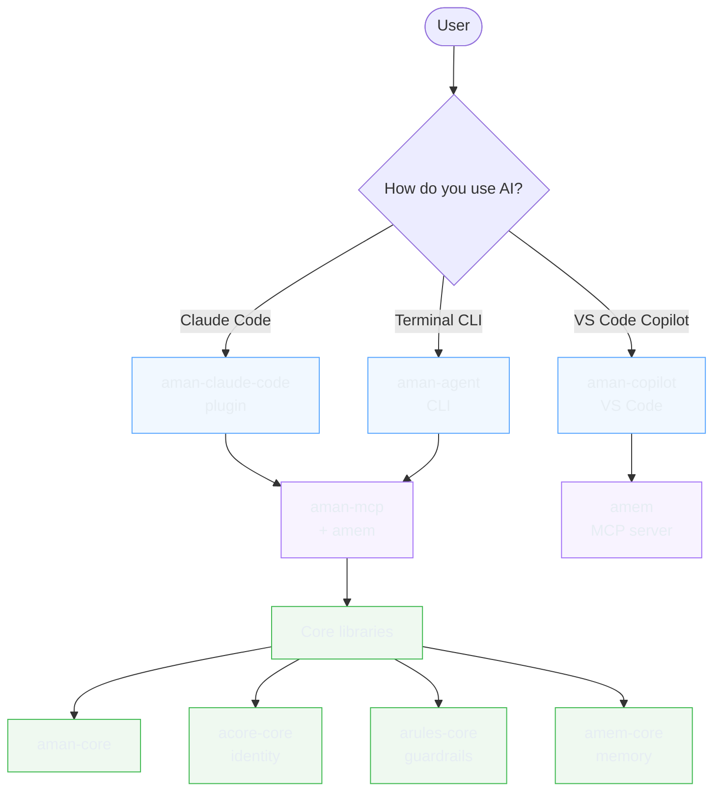

# The aman Ecosystem

The aman ecosystem is composed of roughly ten npm packages, each addressing one concern — identity, memory, rules, orchestration, MCP surfaces, editor integrations, installers. You don't need all of them. This doc answers the onboarding question: **which package do I install, and when?**

---

## Package relationships

**Three layers:**

- **User runtimes** (top) — the thing you actually launch. Pick based on where you work: Claude Code, terminal, or VS Code.
- **MCP servers** (middle) — how runtimes expose memory, identity, and rules to the LLM.
- **Core libraries** (bottom) — shared TypeScript engines. You never install these directly; the runtimes pull them in.

---

## Install decision matrix

| You want… | Install |
|:---|:---|
| Memory + identity across Claude Code sessions, nothing else new | `aman-claude-code` plugin |
| A standalone CLI that runs anywhere (any LLM, no Claude Code required) | `aman-agent` |
| Memory + identity inside VS Code / Copilot Chat | `aman-copilot` + `amem` MCP |
| Everything (CLI, plugin, MCPs) — power user | `aman-agent` + `aman-claude-code` + `aman-mcp` + `amem` |
| Just the memory layer, wired into any MCP-speaking client | `amem` MCP server |
| The full aman persona tooling inside another MCP client (Cursor, Zed, etc.) | `aman-mcp` + `amem` |

**Most people start with one of the first three rows.** You can always layer more later — they all share the same `~/.acore` + `~/.amem` state directories, so memories from the plugin show up in the CLI and vice versa.

---

## What does this package do?

### User runtimes

| Package | What it does | Typical install |
|:---|:---|:---|
| [`aman-agent`](https://github.com/amanasmuei/aman-agent) | Standalone terminal CLI. Full ecosystem in one binary — any LLM, any project, works offline for most things. | `npm i -g @aman_asmuei/aman-agent` |
| [`aman-claude-code`](https://github.com/amanasmuei/aman-claude-code) | Claude Code plugin. Drops identity, rules, memory, and live tools into every Claude Code session. | Follow plugin's install.sh |
| [`aman-copilot`](https://github.com/amanasmuei/aman-copilot) | VS Code extension for GitHub Copilot Chat + Copilot CLI. Same persona surface as the plugin. | VS Code marketplace |

### MCP servers

| Package | What it does | Typical install |
|:---|:---|:---|
| [`aman-mcp`](https://github.com/amanasmuei/aman-mcp) | Full aman MCP server — identity, rules, skills, workflows, tools, eval. Used by any MCP client. | Via MCP client config |
| [`amem`](https://github.com/amanasmuei/amem) | Memory-only MCP server — typed memories, knowledge graph, reminders, progressive disclosure. Lighter-weight sibling to `aman-mcp`. | Via MCP client config |

### Core libraries (dependencies — you don't install these directly)

| Package | What it does |
|:---|:---|
| [`aman-core`](https://github.com/amanasmuei/aman-core) | Shared types, config loader, cross-scope resolution. The thing every other layer imports. |
| [`acore-core`](https://github.com/amanasmuei/acore) | Identity engine — personality, values, relationship memory, dynamics. |
| [`arules-core`](https://github.com/amanasmuei/arules) | Guardrails engine — rule storage, evaluation, toggles. |
| [`amem-core`](https://github.com/amanasmuei/amem) | Memory engine — SQLite + embeddings, extraction, recall, consolidation, markdown mirror. Underlies both `aman-agent` and the `amem` MCP server. |

### Utilities

| Package | What it does | Typical install |
|:---|:---|:---|
| [`akit`](https://github.com/amanasmuei/akit) | Tool installer — one command to fetch and register MCP tools into your config. | `npm i -g @aman_asmuei/akit` |
| [`askill`](https://github.com/amanasmuei/askill) | Skill manager — browse, install, and crystallize skills from the registry. | `npm i -g @aman_asmuei/askill` |
| [`aman-showcase`](https://github.com/amanasmuei/aman-showcase) | Personality templates — ready-made identity presets to seed a new `acore` with a vibe (mentor, builder, critic, etc.). | Cloned or downloaded as needed |

---

## See also

- [README.md](../README.md) — feature-by-feature tour of `aman-agent`
- [Architecture at a Glance](../README.md#architecture-at-a-glance) — internal module diagram for `aman-agent` itself
